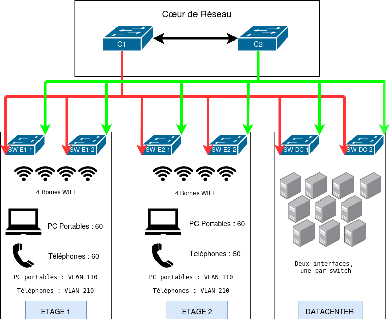

# TP — Architecture réseau du campus NovaCorp

**Livrable S1**  
**Binôme :** Vazquez Angelo / Panariello Mateo / El Khazen Cristophe  
**Date :** 6 octobre 2026

## 1. Architecture logique

Le siège comprend deux étages et une salle serveur. Le dimensionnement prévoit jusqu’à 60 PC portables en Wi-Fi et 60 téléphones IP filaires par étage, environ 10 serveurs et 20 interfaces de management. Les sites distants sont hors périmètre.

| Équipements | Quantité | Rôle |
|---|---:|---|
| Switches de cœur L3 | 2 | Routage entre VLANs et filtrage des communications |
| Switches PoE de 48 ports | 2 par étage | Raccordement et alimentation des bornes et téléphones |
| Bornes Wi-Fi | 4 par étage | Connexion des PC portables |
| Switches datacenter de 24 ports | 2 | Raccordement des dix serveurs aux deux switches |

Les PC portables ne sont pas raccordés directement aux switches : leur trafic passe par les bornes Wi-Fi. Le SSID « NovaCorp-Data » utilise le VLAN 110 à l’étage 1 et le VLAN 120 à l’étage 2. Les bornes sont administrées dans le VLAN 140. Chaque étage nécessite 64 ports pour ses 60 téléphones et ses quatre bornes, hors liaisons vers le cœur.

### Séparation et redondance

Le filtrage entre VLANs autorise uniquement les échanges nécessaires : services métiers vers les serveurs, services de téléphonie pour la voix et administration depuis le poste dédié. Les utilisateurs n’ont pas accès au réseau de management.

Chaque switch d’accès est relié aux deux cœurs. Les bornes sont réparties entre les deux switches de leur étage. Leur couverture et leur capacité doivent permettre la reconnexion des PC portables après la panne d’une borne ou d’un switch ; quatre bornes par étage est une hypothèse à valider selon les locaux. Les serveurs disposent de deux interfaces, une vers chaque switch datacenter. La redondance des passerelles et des services sera définie lors des séances suivantes.

**Limite :** la panne d’un switch coupe les téléphones filaires qui y sont raccordés. La reconnexion Wi-Fi peut également provoquer une brève interruption.

## 2. VLANs

| VLAN | Nom | Usage |
|---|---|---|
| 110 | DATA-E1 | PC portables en Wi-Fi, étage 1 |
| 120 | DATA-E2 | PC portables en Wi-Fi, étage 2 |
| 130 | SERVEURS | Réseau de production des serveurs |
| 140 | MANAGEMENT | Administration des équipements et poste dédié |
| 210 | VOIX-E1 | Téléphones IP filaires, étage 1 |
| 220 | VOIX-E2 | Téléphones IP filaires, étage 2 |

Les 20 interfaces de management couvrent les huit switches, les huit bornes et le poste d’administration, avec une marge de trois interfaces. Les éventuelles interfaces d’administration dédiées des serveurs peuvent nécessiter d’augmenter ce nombre.

## 3. Plan d’adressage IPv4

Bloc privé du siège : **10.10.0.0/16**. Chaque VLAN utilise un /24, soit 254 adresses utilisables, pour conserver une marge de croissance. L’adresse .1 est réservée à la passerelle logique et .2/.3 aux deux cœurs.

| VLAN | Réseau | Masque | Plage utilisable | Diffusion | Passerelle prévue |
|---|---|---|---|---|---|
| 110 | 10.10.10.0/24 | 255.255.255.0 | 10.10.10.1–10.10.10.254 | 10.10.10.255 | 10.10.10.1 |
| 120 | 10.10.20.0/24 | 255.255.255.0 | 10.10.20.1–10.10.20.254 | 10.10.20.255 | 10.10.20.1 |
| 130 | 10.10.30.0/24 | 255.255.255.0 | 10.10.30.1–10.10.30.254 | 10.10.30.255 | 10.10.30.1 |
| 140 | 10.10.40.0/24 | 255.255.255.0 | 10.10.40.1–10.10.40.254 | 10.10.40.255 | 10.10.40.1 |
| 210 | 10.10.110.0/24 | 255.255.255.0 | 10.10.110.1–10.10.110.254 | 10.10.110.255 | 10.10.110.1 |
| 220 | 10.10.120.0/24 | 255.255.255.0 | 10.10.120.1–10.10.120.254 | 10.10.120.255 | 10.10.120.1 |

## 4. Plan d’adressage IPv6

Préfixe du siège pour le document et le laboratoire : **2001:db8:10::/48**. Ce préfixe de documentation sera remplacé par un préfixe attribué à NovaCorp en production. Chaque VLAN reçoit un /64 ; sa mise en œuvre commence au bloc 2.

| VLAN | Usage | Préfixe IPv6 |
|---|---|---|
| 110 | Data étage 1 | 2001:db8:10:10::/64 |
| 120 | Data étage 2 | 2001:db8:10:20::/64 |
| 130 | Serveurs | 2001:db8:10:30::/64 |
| 140 | Management | 2001:db8:10:40::/64 |
| 210 | Voix étage 1 | 2001:db8:10:110::/64 |
| 220 | Voix étage 2 | 2001:db8:10:120::/64 |

## 5. Convention de nommage

Les noms indiquent le rôle, la zone et le numéro. E1/E2 désignent les étages et DC la salle serveur.

| Noms | Équipements |
|---|---|
| C1 / C2 | Switches de cœur |
| SW-E1-1 / SW-E1-2 | Switches d’accès étage 1 |
| SW-E2-1 / SW-E2-2 | Switches d’accès étage 2 |
| SW-DC-1 / SW-DC-2 | Switches datacenter |
| AP-E1-1 à AP-E1-4 | Bornes Wi-Fi étage 1 |
| AP-E2-1 à AP-E2-4 | Bornes Wi-Fi étage 2 |
| SRV1 à SRV10 | Serveurs |
| PC-E1-1 | Exemple de PC portable étage 1 |
| TEL-E1-1 | Exemple de téléphone IP étage 1 |
